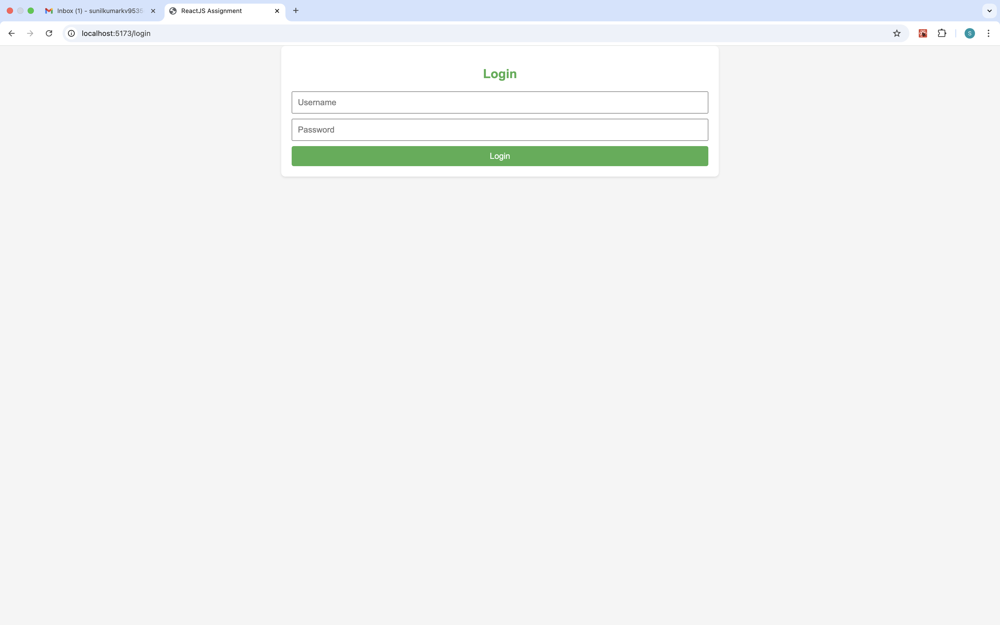
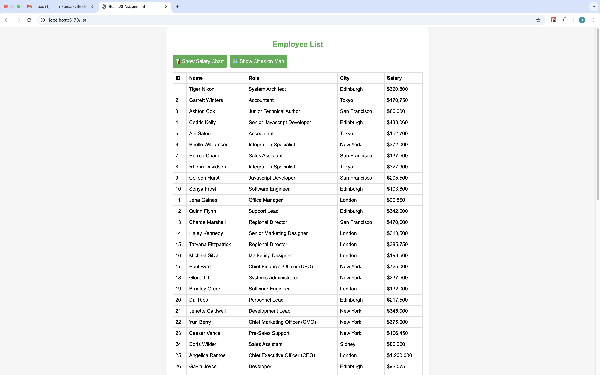
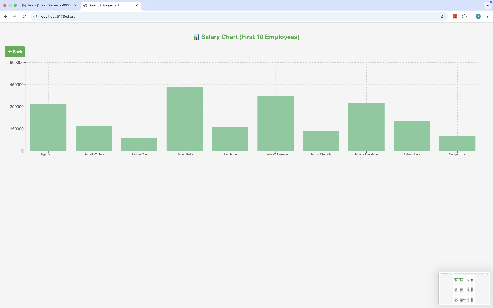
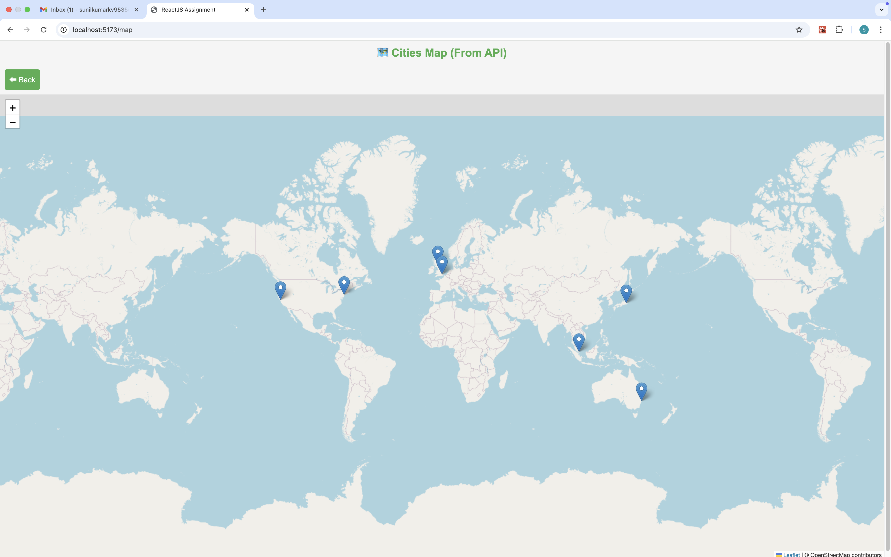
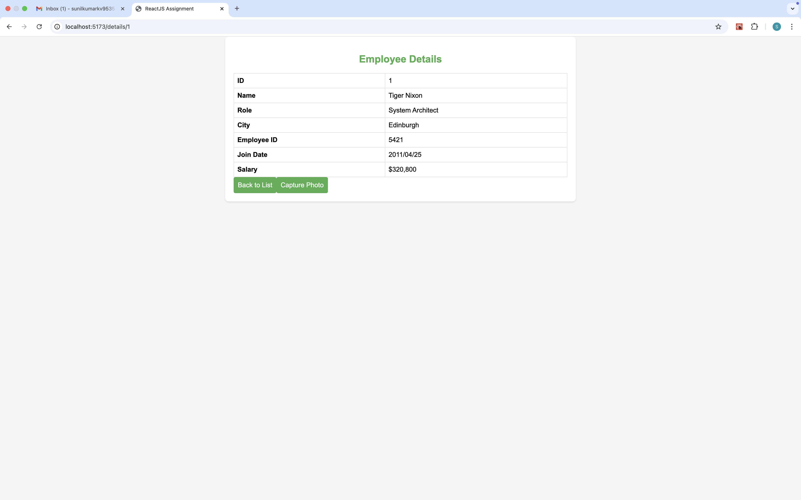

# React Employee Portal

This is a ReactJS web application developed as part of an assignment. The app includes authentication, data listing, detail view with camera access, photo capture, and data visualization using charts and maps.

---

## Features

- **Login Screen**

- Accepts a username and password
- Only allows login with:

  - Username: `testuser`
  - Password: `Test123`

- **List Page**

- Fetches and displays employee data from a REST API
- Shows data in a user-friendly table

- **Bar Graph Page**

- Visualizes salaries of the first 10 employees using a bar graph

- **Map Visualization**

- Displays city locations from the API response on a map

- **Details Page**

- Clicking on a list item opens a detail view
- Includes a button to open the device camera and capture a photo

- **Photo Result Page**
  - Displays the captured image

---

## Live Demo

_....._

---

## 📸 Screenshots

| Login Page                                        | List Page                                                 | Graph Page                                           | Map Page                                      |
| ------------------------------------------------- | --------------------------------------------------------- | ---------------------------------------------------- | --------------------------------------------- | ----------------------------------------------------------- |
|  |  |  |  |  |

---

## 🔧 Tech Stack

- **Frontend**: ReactJS, React Router
- **Charts**: Recharts
- **Maps**: Leaflet.js
- **Camera Access**: HTML5 `getUserMedia`

---

## 📦 Installation & Running the App

```bash
# Clone the repository
git clone https://github.com/SunilKumarKV/react-employee-portal.git
cd react-employee-portal

# Install dependencies
npm install

# Run the development server
npm run dev
```

## API Details

- **Endpoint**: https://backend.jotish.in/backend_dev/gettabledata.php

- **Request Payload**:

```bash
{
"username": "test",
"password": "123456"
}
```

## ✨ Creativity Additions

- Used charts and maps for data visualization

- Captured photo using webcam

- Responsive and clean UI
